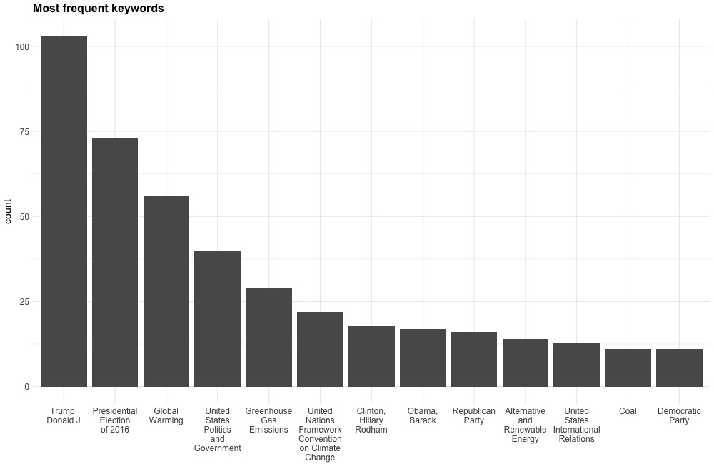
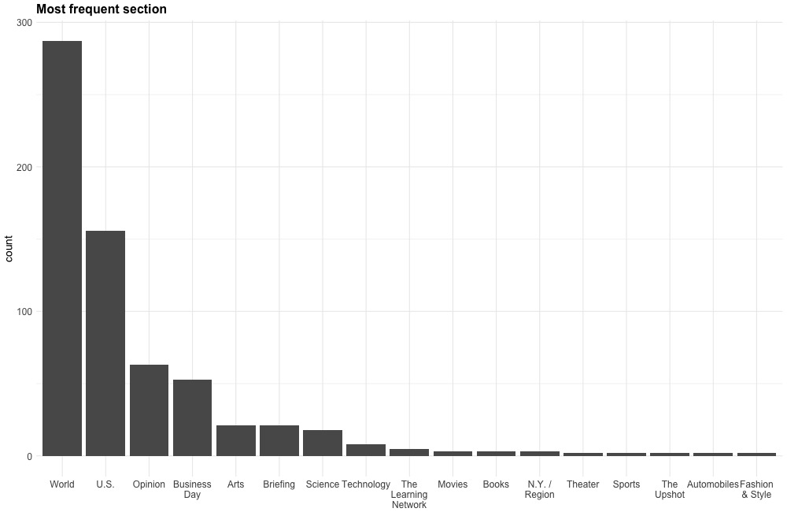
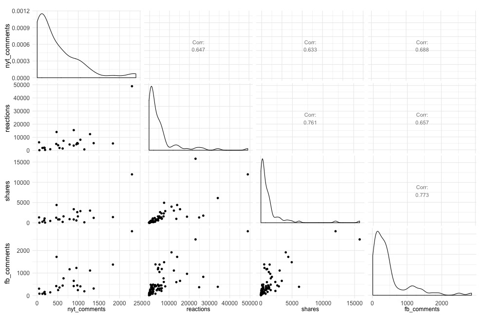
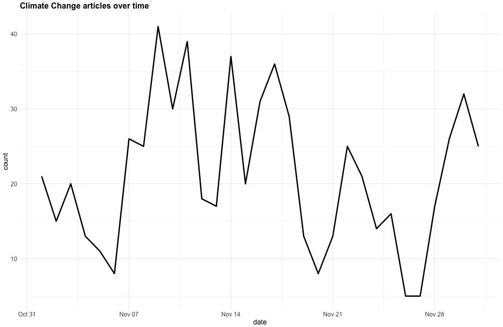
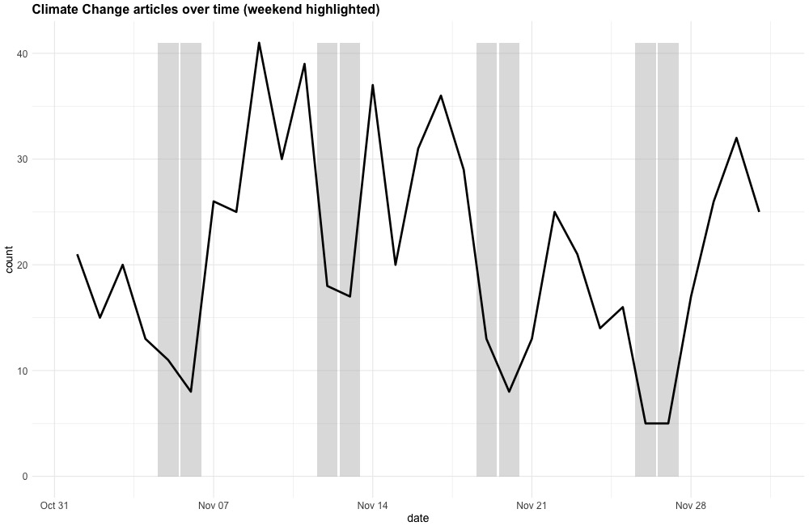
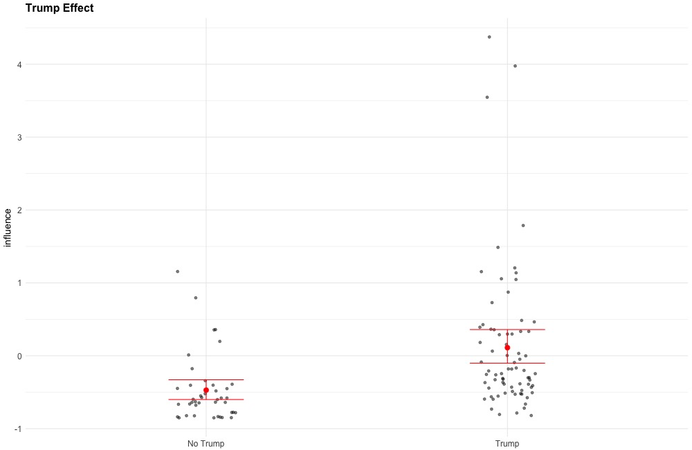

# Climate Change Coverage on the New York Times, 11/01/16 - 12/01/16

This is a report on the New York Times climate change coverage for the month of November, 2016. This report was created at the request of a third party. The requested information was as follows:

> • What are the top keywords associated with those articles in terms of frequency used?  
> • Which section of the Times covers climate change most frequently?  
> • What are the most influential articles? How and why did you come to this conclusion?  
> • Are there any points in time when writing about climate change spikes? To what might you
> attribute that?  
> • Please share additional observations.  

Prior to this challenge, my only experience with the New York Times API was a brief investigation a little more than a year ago. I looked at the documentation only long enough to realize it did not have the information I had needed for that particular project, so this was something of a learning experience for me.

Below I tackle the core questions sequentially. Following that is a description of improvements and next steps. Finally, this document concludes with a description of how to rerun the code to collect the data and generate the plots.

## What are the top keywords associated with those articles in terms of frequency used?

After querying the New York times API for all articles using the term 'climate change' in the specified period, I ended up with a dataset of 659 articles. As part of the output, the API also returns a list of entities mentioned in each article. Using this, I examined what keywords were most frequent. The plot below displays this information for all keywords that appeared more than 10 times.



As is clear from the plot, this dataset is dominated by the election. `Donald Trump` is discussed far more often than anything else, with the election itself coming in a distant second place. The keyword `Global Warming` occurs approximately half as often as Donald Trump, even in a search for articles targeting climate change specifically.

## Which section of the Times covers climate change most frequently?

The API also indicates which section a given article comes from. The figure below shows the number of articles that come from each section of the paper. For readability, I've excluded those sections with just one hit:



It isn't particularly surprising that the `World` and `U.S.` sections have a good deal of coverage. Much of what is written about climate change concerns legislation and international relations. However, I personally find it surprising that `Science` is so far down the list. This could be a function of the fact that I think a lot about science and so see most things in the world through that lens. Another explanation is that there are almost certaintly fewer articles published in the `Science` section than in the other sections.

## What are the most influential articles? How and why did you come to this conclusion?

This question is a bit trickier than the last two, and is where I spent the majority of my time. First, we have to figure out what exactly it means for an article to be *influential*. In modern internet environments, something or someone is deemed influential if they generate lots of hits, shares, comments, likes, tweets, or subsequent articles. There are two tools provides by the NYTimes API that might let us figure this out. The most ideal is their **Most Popular** API (https://developer.nytimes.com/most_popular_api_v2.json). This tools gives you access to the articles most frequently emailed, shared, and viewed. Unfortunately, this tool only covers the most recent 30 days, which would have allowed me only to cover a small subset of the date range specified. If I knew how this investigation would turn out when I first looked at this API, I would have gotten what I could at the time.

Because I was not able to obtain this data, I next used the **Community** API (https://developer.nytimes.com/community_api_v3.json). This tool gives you access to the commenting data on the NYTimes website itself. Articles with more comments should be more influential. Unfortunately, this is also an imperfect tool, as many articles do not allow any comments. Indeed, comments were obtained for only 62 articles.

I next decided to attempt to include some outside data. Fortunately, the New York Times maintains an active and public Facebook account where they post links to articles on their website. Facebook's Graph API (https://developers.facebook.com/docs/graph-api) exposes methods to read and write data that is accessible on Facebook (either through your account, or because the information is publicly available).

Using Facebook's API, I looked through all posts to the New York Times Facebook account from 10/31/2016 to present. Using this method, I found 79 articles that were in my original dataset. For these 79 articles, I was able to obtain the number of reactions (i.e. likes, but now there are multiple response options), comments, and shares that ocurred on the New York Times Facebook post for that article.

In all, I have "influence" data for 116 of the 659 articles. Admittedly, this is poor coverage, though it seems likely that truly influential articles would be posted to the NYTimes Facebook page. If this is so, then this sample is probably biased to include articles that are, on average, more influential. This concept is difficult to test empirically, because posting an article on social media is an act that is *designed* to elicit more influence. One method would be to look at the frequency of comments on the NYTimes website before an article was shared on Facebook and compare that frequency to the rate of comments for articles that were never shared. However, I decided that this was outside the scope of this investigation.

To put the influence data from the two sources on equal footing, I standardized each measure, and computed the mean across each of them. The figure below displays the correlation and distribution for each of these measures, showing strong positive relationships between each of the metrics. This is reassurring, as one of the assumptions here is that each of these is measuring the same underlying construct - influence.



Having obtained one value that indicates influence, we can obtain the most influential articles. The urls for the top five are printed below:


```python
import pandas as pd
df = pd.read_csv('output/infl.csv')
df.sort_values('influence', ascending=False, inplace=True)
for i in df.web_url[0:5]:
    print(i)
```

    http://www.nytimes.com/2016/11/23/opinion/no-trump-we-cant-just-get-along.html
    http://www.nytimes.com/2016/11/12/us/politics/trump-campaigned-against-lobbyists-now-theyre-on-his-transition-team.html
    http://www.nytimes.com/2016/11/09/opinion/donald-trumps-revolt.html
    http://www.nytimes.com/2016/11/17/business/energy-environment/us-companies-to-trump-dont-abandon-global-climate-deal.html
    http://www.nytimes.com/2016/11/12/science/myron-ebell-trump-epa.html


And their influence statistics:


```python
df.loc[:,['web_url', 'nyt_comments', 'reactions', 'shares', 'comments']].head()
```


<div>
<table border="1" class="dataframe">
  <thead>
    <tr style="text-align: right;">
      <th></th>
      <th>web_url</th>
      <th>nyt_comments</th>
      <th>reactions</th>
      <th>shares</th>
      <th>comments</th>
    </tr>
  </thead>
  <tbody>
    <tr>
      <th>379</th>
      <td>http://www.nytimes.com/2016/11/23/opinion/no-t...</td>
      <td>2301.0</td>
      <td>48932.0</td>
      <td>11958.0</td>
      <td>2857.0</td>
    </tr>
    <tr>
      <th>604</th>
      <td>http://www.nytimes.com/2016/11/12/us/politics/...</td>
      <td>NaN</td>
      <td>23113.0</td>
      <td>15819.0</td>
      <td>2495.0</td>
    </tr>
    <tr>
      <th>327</th>
      <td>http://www.nytimes.com/2016/11/09/opinion/dona...</td>
      <td>2397.0</td>
      <td>NaN</td>
      <td>NaN</td>
      <td>NaN</td>
    </tr>
    <tr>
      <th>13</th>
      <td>http://www.nytimes.com/2016/11/17/business/ene...</td>
      <td>NaN</td>
      <td>34113.0</td>
      <td>6115.0</td>
      <td>389.0</td>
    </tr>
    <tr>
      <th>30</th>
      <td>http://www.nytimes.com/2016/11/12/science/myro...</td>
      <td>NaN</td>
      <td>11251.0</td>
      <td>3991.0</td>
      <td>1920.0</td>
    </tr>
  </tbody>
</table>
</div>


Again, this list is dominated by Trump-related articles. 


## Are there any points in time when writing about climate change spikes? To what might you attribute that?

The plot below displays the number of articles that were published on each day during the time period.



As is evident in the plot, there is a good deal of noise in this time period. I would be hesitant to outright declare any of these an anomaly in the statistical sense, but there are two features that stand out to an eye test.

The first is on November 9th. This is, of course, the day after the election. On this day, many articles covered the potential ramifications of a Trump presidency - one of which is what legislative and policy changes with respect to climate change should be expected. 

The second occurs at the end of the month - on November 30th. However, I suspect that this stands out only because the preceding few days featured such low counts. Indeed, those few days before were Thanksgiving weekend, and it stands to reason that much of the staff at the paper took some time off, leading to fewer articles produced. Compound this with the observation that it appears that fewer articles are published on the weekend in general, and it makes the following days appear as something of an outlier. The figure below highlights the dates in this data that are the weekend, illustrating the decrease in published articles on these days.



## Please share additional observations.

As far as additional observations, I decided to perform one further analysis. Given what we've seen above (i.e. dominance of Trump), it should be possible to figure out exactly how much influence Trump buys for an article. The plot below displays this information.



On the y axis is the same metric (standardized influence) used to figure out how influential an article was. For those who had influence data, I divided them into those that contained Donald Trump as a keyword (n=74) and those that did not (n=42). A simple t-test reflects the visual observation that Trump leads to a bump in influence ($m_{trump}$ = .11; $m_{not trump}$ = -.47). To translate this into real observations, this would mean that we would expect an article with trump to elicit approximately 520 comments on the NYtimes, while one without would elicit approximately 205 comments.

## Improvements and next steps

One clear area for improvement of the above analyses is the coverage of influence. Increasing the number of articles with data on influence would allow for a greater degree of certainty with respect to the question of which articles and what topics are influential, and could allow more nuanced analyses. The method I've used to measure influence is flexible enough to allow entering additional measurements of influence. For instance, I could scrape other social media accounts that are likely to have shared articles in this dataset, standardizing the influence metrics for each, before including them in the 'overall' influence metric I used here. 

An alternative or additional method would be to look for which articles in this dataset are linked to within subsequent articles that are published by the NYTimes or other news outlets. While this is not a typical metric for influence in social media data, it's similar to how Google organizes their search results ([PageRank algorithm](https://en.wikipedia.org/wiki/PageRank)).

A second interesting line of inquiry would be to figure out how people respond to certain types of articles. For instance, is the sentiment of comments on Trump articles different from those on non-Trump articles? How do the reactions change after the election in comparison to before?

Finally, should we choose to expand the scope of this analysis beyond the election, we could look at some of these same questions, but with a wider lens - expanding the timeframe back a full year or more. Doing this would let us put this Trump bump in perspective, as well as to focus the exploration more on climate change itself. As it is, this analysis really turned out to be more about the election than anything else. Without some further comparisons, it's difficult to know what to make of these data. Did writing about climate change increase because of Trump? Is this in line with historical trends? Is this trump bump unique to him, or will other big-name politicians see similar increases, especially just after an election?

## Technical details

This report was created using Python 2.7 and R 3.2.3 on Mac OS 10.11.  

Required libraries (Python):
- [numpy](http://www.numpy.org/)
- [pandas](http://pandas.pydata.org/)

Required libraries (R):
- [ggplot2](http://ggplot2.org/)
- [dplyr](https://github.com/hadley/dplyr)
- [stringr](http://stringr.tidyverse.org/)
- [GGally](https://github.com/ggobi/ggally)
- [lubridate](https://github.com/hadley/lubridate)

All temporary files are stored in `/output` as json or csv. R was used primarily to generate plots and run the statistical test at the end. The plots are stored in jpeg form and stored in `/output` as well. 

### How to reproduce
To reproduce code in full, make sure the above librarires are installed as described at the relevant sites. 

Next, obtain api keys for the New York Times and Facebook. Instructions for the New York Times API are found [here](https://developer.nytimes.com/). Instructions for the Facebook API are located [here](https://developers.facebook.com/docs/facebook-login/access-tokens). Note for the Facebook API, you will need an app id number and an app secret. 

Open the `HI.sh` file and replace the triple X's with the relevant api key data. To run this file on a Mac, navigate to the directory containing the file and run `sh HI.sh` in the command line. This file will collect data, generate plots, and write the results of the t-test. If you wish to skip the data collection (as it is the most time intensive), you can run the analyes and plots code only by commenting out the first two lines of `HI.sh`.

### References

Some of the code used to scrape the NYTimes facebook page was taken from this blog post:

http://minimaxir.com/2015/07/facebook-scraper/


```python

```
